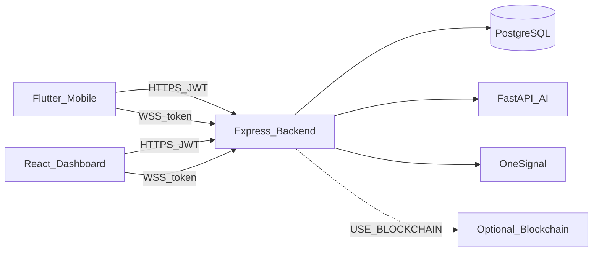
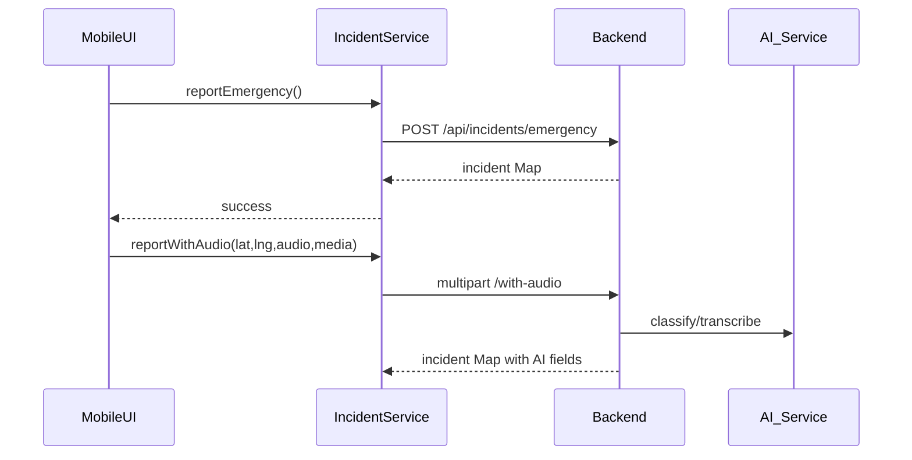
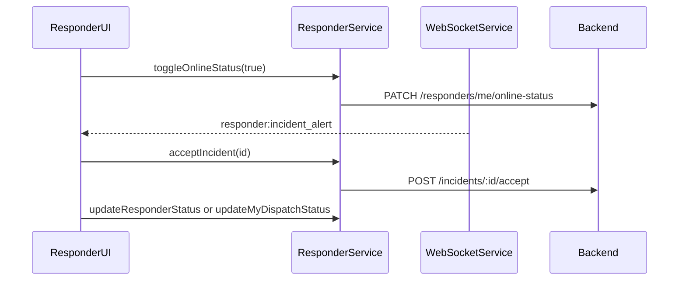

# RescueLink Technical Manual

**Audience:** Developers and technical reviewers who can read the codebase.  
**Scope:** Mobile (Flutter) and Web Dispatcher Dashboard (React) public surfaces — inputs, behavior, and outputs.  
**Not in scope:** Full Backend / AI / Blockchain rewrite — see [API Documentation](../API_DOCUMENTATION.md), [How To Run](../HOW_TO_RUN.md), and service READMEs.

Aligned with the **implemented** system (native Flutter client, OSM maps, email OTP for staff MFA, OneSignal push, optional blockchain). Do not assume SMS chat, Google Maps routing, Twilio, or a national 911 API.

---

## 1. Architecture overview

| Layer | Path | Stack |
|-------|------|--------|
| Mobile | `Frontend/Mobile` | Flutter + BLoC; services under `lib/services/` |
| Dashboard | `Frontend/Web/dispatcher_dashboard` | React + Vite; API modules under `src/data/api/` |
| Backend | `Backend` | Node.js + Express + PostgreSQL |
| AI | `RescueLink AI` | FastAPI; Whisper + classifier |
| Blockchain | `Blockchain` | Optional; feature-flagged |

**Incident status enum (primary):** `pending` → `verified` → `in_progress` → `resolved` → `closed` (archive is separate).

---

## 2. Mobile

### 2.1 Screen map

| Area | Directory | Purpose |
|------|-----------|---------|
| Auth | `lib/screens/auth/`, `otp_*`, `verification/` | Login, signup, OTP, residency, password reset |
| Citizen | `lib/screens/home/` | SOS/home shell, emergency report, history, details, notifications, settings, volunteer apply |
| Responder | `lib/screens/responder/` | Online toggle, alerts, assignments, status stepper, history |
| Department ops | `lib/screens/department/` | Role-gated dept incident list / assign / resolve |
| Shared alerts | `lib/screens/common/emergency_dispatch_alert_modal.dart` | Critical dispatch amber UI |

Navigation shell: `home_placeholder_screen.dart` (tabs). Auth gate: `main.dart` / `AuthNavigator` + `AuthBloc`.

### 2.2 Config (env key names only)

From `lib/utils/app_config.dart` and OneSignal init:

| Key | Used for |
|-----|----------|
| `API_BASE_URL` | Backend base URL (default emulator `http://10.0.2.2:3000`) |
| `RECAPTCHA_SITE_KEY` | Optional reCAPTCHA on verification UI |
| `ONESIGNAL_APP_ID` | Mobile push; skipped if unset |

Constants: `apiTimeout` 30s; Dagupan default lat/lng in `AppConfig`.

### 2.3 `ApiService` (`api_service.dart`)

Generic authenticated HTTP client to `AppConfig.apiBaseUrl`.

| Method | Inputs | Output / effect |
|--------|--------|-----------------|
| `get(path, {headers})` | Relative path, optional headers | Decoded JSON `Map` or throws `ApiException` |
| `post(path, {body, headers})` | Path + JSON body | Same |
| `patch` / `put` / `delete` | Path + optional body | Same |

### 2.4 `AuthService` (`auth_service.dart`)

Session, Firebase phone verification, profile, location helpers used during onboarding.

| Method | Inputs | Calls / effect | Output |
|--------|--------|----------------|--------|
| `init()` | — | Load stored JWT / profile cache | `void` |
| `logout()` | — | `POST /api/auth/logout`; clear token; OneSignal logout | `void` |
| `setToken` / `clearToken` / `getToken` | token string | Local secure/prefs storage | — |
| Biometric helpers | `enabled`, phone/password/token | Local secure storage | bool / credentials / void |
| `getProfile()` | — | `GET /api/auth/me` | `Map` user |
| `updateProfile({...})` | name/address fields | `PATCH /api/auth/me` | `Map` user |
| `fetchAvatarBytes` / `uploadAvatar` / `deleteAvatar` | `File` for upload | `/api/auth/me/avatar` | bytes / `Map` |
| `changePassword({currentPassword, newPassword})` | passwords | `POST /api/auth/change-password` | `Map` |
| `register({..., captchaToken})` | registration + reCAPTCHA token | `POST /api/auth/register` | `Map` (`verificationRequired`; no account until OTP) |
| `login({phone, password})` | credentials | `POST /api/auth/login` | `Map` (token/user) |
| `verifyOtp({phone, otp})` | phone + OTP | `POST /api/auth/verify-otp` (backend/IPROG) | `Map` |
| `requestPasswordResetOtp({phone, captchaToken})` | phone + CAPTCHA | `POST /api/auth/forgot-password/sms` | `Map` (generic success) |
| `resendPasswordResetOtp({phone, captchaToken})` | phone + fresh CAPTCHA | `POST /api/auth/forgot-password/sms/resend` | `Map` |
| `verifyPasswordResetOtp({phone, otp})` | phone + OTP | `POST /api/auth/forgot-password/sms/verify` | `Map` with `resetToken` |
| `resetPassword(resetToken, newPassword)` | short-lived JWT, password | `POST /api/auth/reset-password` | `Map` |
| `resendOtp({phone, captchaToken})` | phone + fresh CAPTCHA | `POST /api/auth/resend-otp` | `Map` |
| `getCurrentLocation({...})` | optional accuracy | Device GPS | `{success, latitude, longitude, error?}` |
| `getBarangayFromCoordinates(lat, lng)` | coords | `GET /api/location/barangay` | `String?` |
| `reverseGeocode(lat, lng)` | coords | `GET /api/location/reverse` | address `Map` |
| `searchLocations(query, {limit})` | query | `GET /api/location/search` | results `Map` |
| `checkLocationInDagupan({lat, lng})` | coords | `POST /api/location/check` | `{success, isInDagupan, …}` |
| Role helpers | — | prefs/JWT | `isVolunteer`, `isPersonnelResponder`, `isDepartmentOps`, `hasResponderTab`, `hasOpsTab`, `getDepartmentCode` / `Name` |

### 2.5 `GeolocationService` (`geolocation_service.dart`)

| Method | Inputs | Output |
|--------|--------|--------|
| `loadDagupanPolygon()` | — | `List<List<double>>` polygon rings (cached) |
| `requestLocationPermission()` / `checkLocationPermission()` | — | `LocationPermission` |
| `getCurrentPosition()` | — | `Position` |
| `pointInPolygon` / `pointInPolygonWithBuffer` / `calculateDistance` | coords + polygon | `bool` / meters |
| `isPointInDagupan(lat, lng, {bufferMeters})` | doubles | `Future<bool>` |

### 2.6 `IncidentService` (`incident_service.dart`)

| Method | Inputs | Endpoint | Output |
|--------|--------|----------|--------|
| `reportEmergency()` | Uses current GPS via AuthService | `POST /api/incidents/emergency` `{latitude, longitude}` | `Map` (created incident) |
| `reportWithAudio({latitude, longitude, description?, audioBytes, audioFilename, mediaFiles?})` | Multipart audio required; media optional | `POST /api/incidents/with-audio` | `Map` JSON body |
| `getMyIncidents({limit, offset, status, incidentType, involvement})` | filters | `GET /api/incidents/user/my?...` | `List` |
| `getIncidentById(reportId, {withAi})` | id | `GET /api/incidents/:id` or `.../with-ai` | `Map` |
| `getIncidentWithAiFallback(reportId)` | id | tries with-ai → plain | `{incident, ai_classification}` |
| `downloadIncidentAudio(reportId)` | id | `GET /api/incidents/:id/audio` | `IncidentFileDownload` |
| `downloadIncidentMedia(reportId, mediaIndex)` | id, index | `GET /api/incidents/:id/media/:index` | `IncidentFileDownload` |
| `confirmIncidentResolution(reportId)` | id | `POST /api/incidents/:id/confirm-resolution` | `Map` |
| `close()` | — | Close HTTP client | `void` |

Throws `IncidentServiceException` on location/network/HTTP failure.

### 2.7 `NotificationService` (`notification_service.dart`)

| Method | Inputs | Endpoint | Output |
|--------|--------|----------|--------|
| `getNotifications({limit, offset})` | pagination | `GET /api/notifications` | `List<Map>` |
| `markAllAsRead()` | — | `POST /api/notifications/mark-all-read` | `int` (affected) |
| `getUnreadCount()` | — | `GET /api/notifications/unread-count` | `int` (0 on error) |

### 2.8 `OneSignalService` (`onesignal_service.dart`)

| Method | Inputs | Effect / output |
|--------|--------|-----------------|
| `init({onNotificationOpened})` | optional open callback | Init SDK if `ONESIGNAL_APP_ID` set |
| `setOnNotificationOpened(cb)` | `void Function(String reportId)` | Deep-link handler |
| `setOnCriticalPush(cb)` | `(reportId, alertKind?)` | Foreground critical push → amber coordinator |
| `requestPermission` / `isPushEnabled` / `setPushEnabled` | bool | Permission + opt-in state |
| `loginUser(userId)` / `logoutUser()` | external user id | Bind/unbind OneSignal External ID |
| `ensureOptedInIfAllowed()` | — | Re-opt-in when OS allows |

### 2.9 `WebSocketService` (`websocket_service.dart`)

Singleton. URL: `ws(s)://{apiHost}/ws?token=JWT`.

| API | Inputs | Output / effect |
|-----|--------|-----------------|
| `connect()` / `disconnect()` / `dispose()` | — | Open/close channel; exponential reconnect |
| `eventStream` | — | `Stream<IncidentEvent>` (`event` + `data` map) |
| `statusStream` | — | connecting / connected / disconnected / reconnecting |

`IncidentEvent` helpers: `reportId`, `status`, `incidentType(s)`, `severityLevel`, `barangay`, etc.

Typical events consumed on mobile: `incident:created`, `incident:updated`, `incident:status_updated`, `responder:incident_alert`, backup-related events (coordinators).

### 2.10 `ResponderService` (`responder_service.dart`)

| Method | Inputs | Endpoint | Output |
|--------|--------|----------|--------|
| `toggleOnlineStatus(online, {latitude, longitude})` | bool + optional coords | `PATCH /api/responders/me/online-status` | `void` |
| `getSelfProfile()` | — | `GET /api/responders/me/profile` | `Map` |
| `getActiveIncidents()` | — | `GET /api/incidents/responder/active` | `List<Map>` |
| `getAssignedIncidents()` | — | `GET /api/responders/me/assigned-incidents` | `List` from `incidents` |
| `getMyTeam()` | — | `GET /api/responders/me/team` | `Map` |
| `updateMyDispatchStatus(reportId, status)` | id, `response_status` | `PATCH /api/dispatches/me/status` | `void` |
| `getIncidentHistory({page})` | page | `GET /api/incidents/responder/history` | `List` |
| `getIncidentPreview(reportId)` | id | `GET /api/incidents/:id/responder-preview` | `Map` |
| `acceptIncident(reportId)` | id | `POST /api/incidents/:id/accept` | `Map` |
| `declineIncident(reportId)` | id | `POST /api/incidents/:id/decline` | `void` |
| `updateResponderStatus(reportId, status)` | id, status | `PATCH /api/incidents/:id/responder-status` | `void` |
| `requestBackup(reportId, target, {notes})` | target e.g. CDRRMO/nearby | `POST /api/incidents/:id/backup` | `Map` |
| `joinBackup(reportId, backupId)` | ids | `POST /api/incidents/:id/backup/:backupId/join` | `Map` |
| `declineBackup` / `withdrawBackup` | ids | `.../decline` / `.../withdraw` | `void` |
| `updateBackupResponderStatus` | ids + status | `PATCH .../backup/:backupId/responder-status` | `void` |
| `getBackupRequests(reportId)` | id | `GET /api/incidents/:id/backup` | `List` |

### 2.11 `ResponderApplicationService`

| Method | Inputs | Endpoint | Output |
|--------|--------|----------|--------|
| `getMyApplication()` | JWT | `GET /api/responder-applications/me` | `Map` status |
| `submitApplication({personalDetails, govIdFile, specializationFields, fieldProofFiles, certificateFiles, otherDocFiles})` | multipart | `POST /api/responder-applications` | `Map` |

Fields: `personal_details` + `specialization_fields` JSON; files `gov_id`, `proof_<field>`, `certificates`, `other_docs`.

### 2.12 `DepartmentOpsService`

| Method | Inputs | Endpoint | Output |
|--------|--------|----------|--------|
| `listDepartmentIncidents({limit, offset})` | pagination | `GET /api/incidents?exclude_duplicates=true` (server scopes dept) | `List<Map>` |
| `listTeams({departmentCode})` | optional code | `GET /api/responders/teams` | `List` |
| `assignTeam({reportId, departmentCode, departmentName?, teamName})` | assignment | `POST /api/dispatches` | `Map` |
| `reassignTeam({reportId, departmentCode, teamName, reason})` | reason ≥ 10 chars | `POST /api/dispatches/reassign-team` | `Map` |
| `resolveIncident(reportId)` | id | `PATCH /api/incidents/:id/status` `{status: resolved}` | `Map` |

### 2.13 Alert coordinators and helpers

| Service | Public API | Role |
|---------|------------|------|
| `ResponderAlertCoordinator` | `start` / `stop` / `setOnline` / `handleEvent` / `consumeReport` / `refreshOnlineStatus` | WS volunteer alerts → `IncidentAlertModal`; online gate; dedupe |
| `EmergencyDispatchAlertCoordinator` | `start` / `stop` / `handleEvent` / `handleCriticalPush` / `consumeReport` / `dismissActiveAlert` | `incident:dispatched` + critical push → amber modal for ops/personnel |
| `AmberAlertSound` | `start` / `stop` | Plays `sounds/emergency_alert.wav` (≤1 min); `stop` also hits native `rescuelink/amber` |
| `ThemeService` | `getThemeMode` / `setThemeMode` | Persist light/dark/system |

### 2.14 Key mobile flows

---

## 3. Web Dispatcher Dashboard

### 3.1 Route / RBAC table

Defined in `src/App.jsx` with `ProtectedRoute` + `ROLES` from `src/core/constants/index.js`.

Web role strings: `super-admin`, `dispatcher`, `department-admin`, `department-head`, `personnel` (backend `admin` normalizes to super-admin).

| Path | Allowed roles |
|------|----------------|
| `/login`, `/forgot-password`, `/enter-code`, `/create-password`, `/reset-password` | Public |
| `/dashboard` | Super Admin, Dispatcher |
| `/responder-applications`, `/responder-applications/:id` | Super Admin, Dispatcher |
| `/insights` | Super Admin, Department Admin |
| `/department/dashboard`, `/department/personnel` | Super Admin, Department Admin |
| `/department/assigned-incidents` | Department Head only |
| `/department/tasks` | Redirect → `/department/dashboard` |
| `/departments`, `/departments/:id` | Super Admin |
| `/audit`, `/adminactions` → `/adminactions`, `/team`, `/settings` | Super Admin |
| `/map`, `/profile`, `/help`, `/incidents/:id` | Any authenticated staff role |
| `/` | Redirect by `getDefaultRouteByRole` |

**Default routes:** Dispatcher → `/dashboard`; Dept Admin → `/department/dashboard`; Dept Head → `/department/assigned-incidents`; Personnel → `/department/tasks` (then redirected).

Unwired page files (not in router): e.g. `DepartmentVehiclesPage.jsx` — do not document as live UI.

### 3.2 Session + HTTP helpers

**`core/auth/session.js`**

| Export | Behavior |
|--------|----------|
| `hydrateAuthStores` | Sync `token` / `user` between localStorage ↔ sessionStorage |
| `getAuthToken` / `persistAuthToken` | Read/write JWT in both stores |
| `getStoredUser` / `persistAuthUser` / `getStoredRole` | User JSON + `normalizeRole` |
| `hasRoleAccess(currentRole, allowedRoles)` | Empty allowlist → true; else membership check |
| `clearAuthSession` | Clear MFA session token + auth keys; `sessionStorage.clear()` |

**`http.js`**

| Export | Inputs | Output |
|--------|--------|--------|
| `createRequestId(prefix)` | string | correlation id |
| `getAuthHeaders({requestId, includeContentType})` | options | `Authorization: Bearer` + headers |
| `parseJsonOrEmpty(response)` | Response | object or `{}` |
| `parseErrorMessage(data, fallback)` | body | string |
| Latency snapshot helpers | — | debug metrics |

JWT is dual-stored so OneSignal `web_url` new tabs can authenticate.

### 3.3 `auth.api.js`

| Function | Args | Method / path | Returns |
|----------|------|---------------|---------|
| `loginDispatcher(email, password)` | strings | `POST /api/auth/dispatcher/login` | `{user, token}` or `{sessionToken, message}` if MFA |
| `verifyDispatcherOtp(sessionToken, otp)` | strings | `POST /api/auth/dispatcher/verify-otp` | `{user, token}` |
| `getMe()` | — | `GET /api/auth/me` | `user` object |
| `updateMe(fields)` | `{firstName?, lastName?, address?}` | `PATCH /api/auth/me` | `user` |
| `fetchAvatarBlob()` | — | `GET /api/auth/me/avatar` | `Blob` or `null` |
| `uploadAvatar(file)` | `File` | `POST` multipart avatar | `user` |
| `deleteAvatar()` | — | `DELETE` avatar | `user` |
| `changePassword(current, new)` | strings | `POST /api/auth/change-password` | `{message}` |
| `logout()` | — | `POST /api/auth/logout` | swallows errors; clear client session separately |
| `invalidateAvatarCache()` | — | local | void |

### 3.4 `incidents.api.js`

| Function | Args | Method / path | Returns |
|----------|------|---------------|---------|
| `normalizeIncidentStatus(value)` | string | — | canonical status |
| `getIncidents({limit, offset, severity_level, status, incident_type, barangay, exclude_duplicates, search, exclude_report_id, volunteer_accepted, archived, withMeta})` | filters | `GET /api/incidents?...` | array or `{items, totalCount, limit, offset}` |
| `getIncidentById(id)` | id | `GET /api/incidents/:id` | incident object |
| `getIncidentWithAi(id)` | id | `GET /api/incidents/:id/with-ai` | `{incident, ai_classification}` |
| `verifyIncident(id)` | id | `POST /api/incidents/:id/verify` | verify / blockchain save result |
| `updateIncidentStatus(id, status, metadata)` | id, status, meta | `PATCH /api/incidents/:id/status` | `{success, incident}` |
| `reclassifyIncident(id, payload)` | type/severity/reason | `POST /api/incidents/:id/reclassify` | updated + override |
| `getIncidentAudioUrl(id)` | id | `GET /api/incidents/:id/audio` | blob URL string |
| `getCoordinationNotes(id)` | id | `GET /api/incidents/:id/coordination-notes` | notes array |
| `addCoordinationNote(id, {note})` | id, note | `POST .../coordination-notes` | created note |
| `getIncidentDuplicates(id)` | id | `GET /api/incidents/:id/duplicates` | duplicate info |
| `getPotentialDuplicates(id)` | id | `GET /api/incidents/:id/potential-duplicates` | `{potential_duplicates}` |
| `linkDuplicate(id, parentReportId, reason?)` | ids, reason | `POST /api/incidents/:id/link-duplicate` | result |
| `unlinkDuplicate(id, reason?)` | id, reason | `POST /api/incidents/:id/unlink-duplicate` | result |
| `clearDuplicateFlag(id)` | id | `POST /api/incidents/:id/clear-duplicate-flag` | result |
| `getIncidentMediaUrl(id, index)` | id, index | `GET /api/incidents/:id/media/:index` | `{url, filename, contentType}` |
| `getBackupRequests(id)` | id | `GET /api/incidents/:id/backup` | array |
| `acknowledgeBackupRequest(incidentId, backupId)` | ids | `PATCH .../backup/:backupId/acknowledge` | ack |
| `archiveIncident(id, {archive_notes}?)` | id, notes | `POST /api/incidents/:id/archive` | result |
| `unarchiveIncident(id)` | id | `POST /api/incidents/:id/unarchive` | result |
| `getIncidentEscalations(reportId)` | id | `GET /api/incidents/:id/escalations` | array |
| `createIncidentEscalation(reportId, payload)` | id, payload | `POST .../escalations` | object |
| `updateIncidentEscalationStatus(reportId, escalationId, payload)` | ids, payload | `PATCH .../escalations/:eid/status` | updated |

List calls use short-lived client cache + in-flight dedupe.

### 3.5 `dispatches.api.js`

| Function | Args | Path | Returns |
|----------|------|------|---------|
| `createDispatch(payload)` | report_id, team/responder fields | `POST /api/dispatches` | dispatch result |
| `undoDepartmentNotification(payload)` | report/dept identifiers | `POST /api/dispatches/undo-department` | result |
| `confirmSuggestion(payload)` | suggested team payload | `POST /api/dispatches/confirm-suggestion` | result |
| `reassignTeam(payload)` | report, team, reason | `POST /api/dispatches/reassign-team` | result |

### 3.6 Departments, responders, applications, admin, audit, location, analytics, notifications

**`departments.api.js`** — `GET/POST /api/departments`; `GET/PUT/DELETE /api/departments/:id`; units `GET/POST /api/departments/:id/units`; `POST .../units/:unitId/assign`.

**`responders.api.js`** — `GET/POST /api/responders`; `PUT /api/responders/:id`; `PATCH /api/responders/:id/status`; teams under `/api/responders/teams` (+ members add/remove).

**`responderApplications.api.js`**

| Function | Path |
|----------|------|
| `listApplications` | `GET /api/responder-applications` → `{applications, total}` |
| `getApplicationById` | `GET /api/responder-applications/:id` |
| `updateApplicationStatus` | `PATCH /api/responder-applications/:id/status` |
| `revokeResponderRole` | `POST /api/responder-applications/:id/revoke` |
| `getDocumentUrl` | builds `GET .../documents/:filename?token=` |

**`adminUsers.api.js`:** `GET/POST /api/admin/users`; `PUT .../:id/role`; `PUT .../:id/deactivate`.

**`auditLog.api.js`:** `GET /api/audit-logs`; `GET /api/audit-logs/admin`.

**`location.api.js`:** `POST /api/location/closest-units`; `GET /api/location/search`; `GET /api/location/reverse`; `POST /api/location/geofence-alerts`; `GET /api/location/heatmap`.

**`analytics.api.js` (Insights):** `GET /api/analytics/overview`; `GET /api/analytics/incidents`; `GET /api/analytics/export.csv`; `GET /api/analytics/barangays.geojson`. Params include date range and `department_id` (incl. `volunteers` virtual scope for Super Admin).

**`notifications.api.js`:** `GET /api/notifications`; `POST /api/notifications/:id/read`; `POST /api/notifications/mark-all-read`; `GET /api/notifications/unread-count`.

### 3.7 `useIncidentWebSocket`

Transport: `WS(S) {API_URL}/ws?token=…`. Every message also fires DOM `incident:updated` with `{incidentId, event, data}`.

| Return field | Meaning |
|--------------|---------|
| `status` | `connected` \| `reconnecting` \| `disconnected` |
| `notifications` | In-memory toast list from WS events |
| `clearNotifications` | Clear local list |
| `lastHighSeverity` | Set on `incident:created` when severity high/critical |
| `lastDispatched` | `incident:dispatched` |
| `lastBackupRequested` / `lastBackupJoined` | `responder:backup_requested` / `responder:backup_joined` |
| `lastEscalated` | any `incident:escalat*` |

Other titled events include `incident:status_updated`, `incident:verified`, `incident:resolution_confirmed`, `incident:note_added`, `incident:accepted`, escalation accepted/declined/cancelled/resolved, `responder:status_changed`, backup acknowledged/declined/status_changed.

### 3.8 OneSignal web (`oneSignalWebService.js`)

| Function | Behavior |
|----------|----------|
| `getPushNotificationState()` | `granted` \| `denied` \| `default` \| `unsupported` |
| `initOneSignal(onNotificationClick?)` | Init if `ONESIGNAL_APP_ID`; click → `/incidents/:id` |
| `setOneSignalUser(userId, {role?, departmentId?, departmentCode?})` | External ID + tags + opt-in |
| `logoutOneSignal()` | SDK logout |
| `requestPushPermission()` | Native permission → opt-in/sync; `boolean` |
| `syncOneSignalSubscriptionToBackend(subscriptionId)` | `POST /api/auth/onesignal-subscription` `{onesignal_player_id}` |

### 3.9 Key page behaviors (implementation anchors)

| Behavior | Where | Calls |
|----------|-------|-------|
| Queue filter/sort | `DashboardPage` | `getIncidents` |
| Verify / reclassify / status | `IncidentDetailsPage` | `verifyIncident`, `reclassifyIncident`, `updateIncidentStatus` |
| Duplicate link/unlink | detail + dialogs | `linkDuplicate`, `unlinkDuplicate`, `clearDuplicateFlag` |
| Dispatch / confirm suggestion | detail / dispatch UI | `createDispatch`, `confirmSuggestion`, `reassignTeam` |
| Applications approve/reject | application pages | `updateApplicationStatus` |
| Insights filters + live refresh | `InsightsPage` | analytics APIs + `incident:updated` debounce |

Feature flag: `VITE_USE_BLOCKCHAIN` toggles blockchain vs audit-trail labels in UI (backend `USE_BLOCKCHAIN`).

---

## 4. Cross-cutting roles and flags

### Backend roles (`Backend/src/config/roles.js`)

`user`, `volunteer`, `responder`, `dispatcher`, `supervisor`, `admin`, `department-admin`, `department-head`.

Mobile citizens use `user` → may become `volunteer` after application approval; department/responder staff use corresponding roles. Web dashboard maps `admin` → `super-admin` for route gates.

### Feature flags affecting clients

| Flag | Where | Effect |
|------|-------|--------|
| `USE_BLOCKCHAIN` | Backend `.env` | Verify writes on-chain vs audit UUID |
| `VITE_USE_BLOCKCHAIN` | Web `.env` | UI labeling |
| `ONESIGNAL_APP_ID` | Mobile + Web `.env` | Push enablement |
| `DISPATCHER_MFA_ENABLED` | Backend | Login returns `sessionToken` → OTP step |

---

## 5. Pointers (do not duplicate)

| Topic | Document |
|-------|----------|
| Full HTTP API | [API Documentation](../API_DOCUMENTATION.md), `Backend/api-spec/swagger.json` |
| Features inventory | [Final List of Features](../FINAL_LIST_OF_FEATURES.md) |
| End-user procedures | [User Manual](USER_MANUAL.md) |
| Thesis vs system corrections | [THESIS_SYSTEM_INCONSISTENCIES.md](THESIS_SYSTEM_INCONSISTENCIES.md) |
| Duplicate ops design | [web/duplicate-management.md](../web/duplicate-management.md) |
| Realtime sync | [web/realtime-sync-design.md](../web/realtime-sync-design.md) |
| OneSignal amber setup | [guides/ONESIGNAL_AMBER_ALERT_SETUP.md](../guides/ONESIGNAL_AMBER_ALERT_SETUP.md) |
| Security | [SECURITY_DOCUMENTATION.md](../SECURITY_DOCUMENTATION.md) |

---

## 6. Document control

| Item | Value |
|------|--------|
| Document | RescueLink Technical Manual (Mobile + Dashboard) |
| Depth | Public services / API modules and major flows — not every private widget method |
| Source paths | `Frontend/Mobile/lib/services/*`, `Frontend/Web/dispatcher_dashboard/src/data/api/*`, `App.jsx` |
