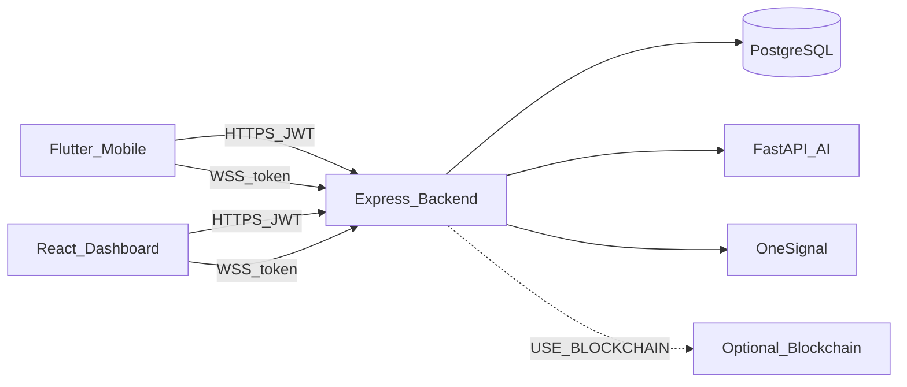

# RescueLink Technical Manual

**Audience:** Technical reviewers who need feature behavior: inputs, system response, rules, and risks.  
**Platforms:** Mobile app (Flutter) and Web Dispatcher Dashboard (React).  
**Service area:** Dagupan City, Philippines.

> **Important:** RescueLink is a digital reporting and dispatch aid. It does **not** replace national emergency hotlines. For an immediate life-threatening emergency, call **911** in addition to using the app when it is safe to do so.

Aligned with the **implemented** system (native Flutter client, OSM maps, IPROG SMS OTP for citizen password reset, email OTP for staff MFA, OneSignal push, optional blockchain). Do not assume SMS chat, Google Maps routing, Twilio, Firebase Phone Auth, or a national 911 API.

**Incident status enum (primary):** `pending` → `verified` → `in_progress` → `resolved` → `closed` (archive is separate).

End-user steps are in [User Manual](USER_MANUAL.md). Full HTTP contracts stay in [API Documentation](../API_DOCUMENTATION.md).

---

## 1. Architecture overview

```mermaid
flowchart LR
  Mobile[Flutter_Mobile]
  Web[React_Dashboard]
  API[Express_Backend]
  AI[FastAPI_AI]
  DB[(PostgreSQL)]
  OS[OneSignal]
  BC[Optional_Blockchain]

  Mobile -->|HTTPS_JWT| API
  Web -->|HTTPS_JWT| API
  Mobile -->|WSS_token| API
  Web -->|WSS_token| API
  API --> DB
  API --> AI
  API --> OS
  API -.->|USE_BLOCKCHAIN| BC
```

| Layer      | Path                                | Stack                                           |
| ---------- | ----------------------------------- | ----------------------------------------------- |
| Mobile     | `Frontend/Mobile`                   | Flutter + BLoC; services under `lib/services/`  |
| Dashboard  | `Frontend/Web/dispatcher_dashboard` | React + Vite; API modules under `src/data/api/` |
| Backend    | `Backend`                           | Node.js + Express + PostgreSQL                  |
| AI         | `RescueLink AI`                     | FastAPI; Whisper + classifier                   |
| Blockchain | `Blockchain`                        | Optional; feature-flagged                       |

Mobile HTTP goes through `ApiService` (`apiTimeout` 30s) to `API_BASE_URL`. Web HTTP uses `http.js` with a Bearer JWT stored in both `localStorage` and `sessionStorage` so a OneSignal `web_url` tab can authenticate. Realtime on both clients is `ws(s)://{apiHost}/ws?token=JWT`.

---

## 2. Mobile App Features

### 2.1 Citizen Account Registration and Residency Verification

**Feature Name:** Citizen Account Registration and Residency Verification

**Feature Description (technical):** Creates a citizen account only after phone OTP verification and a Dagupan geofence check. `AuthService.register` posts registration fields plus an optional reCAPTCHA token. The account is not persisted as a usable session until OTP succeeds. Location is checked with device GPS and the Dagupan polygon (`GeolocationService`) plus `POST /api/location/check`.

**Inputs:**

- Registration payload: name and profile fields, phone, password, optional `captchaToken` (`RECAPTCHA_SITE_KEY` when the verification UI requires it).
- OTP: phone + code via `POST /api/auth/verify-otp`. Resend uses `POST /api/auth/resend-otp` with a fresh CAPTCHA.
- Location: device GPS (`getCurrentLocation` / `getCurrentPosition`). Barangay lookup is `GET /api/location/barangay`.

**Outputs / System Response:**

- `register` returns a map with `verificationRequired`. No login token until OTP completes.
- `checkLocationInDagupan` returns `{success, isInDagupan, …}`.
- On success the client stores the JWT and reaches Home. Outside the polygon the residency screen blocks operations.

**Business Rules / Logic:**

- Service area is Dagupan only. `isPointInDagupan` supports an optional meter buffer around the polygon.
- Pending `password_reset` OTP purpose cannot create an account through registration `verify-otp` / `resend-otp` (those require `passwordHash`).
- Default map center coordinates live in `AppConfig` (Dagupan lat/lng).

**Edge Case or Risk:**

- OTP never arrives or the code expires: resend requires a new CAPTCHA; leaving the screen too long invalidates the attempt.
- GPS indoors or with permission denied reports outside the service area even when the user is in Dagupan. Retry after a precise fix.
- Unknown or mistyped phone numbers must not be treated as proof that an account exists.

---

### 2.2 Mobile App Sign In and Biometric Unlock

**Feature Name:** Mobile App Sign In and Biometric Unlock

**Feature Description (technical):** Authenticates a citizen, volunteer, or field account with phone and password, then optionally unlocks later sessions from credentials stored only on the device. Password recovery is IPROG SMS, not Firebase Phone Auth and not the dispatcher email flow.

**Inputs:**

- Login: `{phone, password}` → `POST /api/auth/login`.
- Biometric toggle: local secure storage of enabled flag plus phone/password/token. Re-enable may require the password.
- Forgot password: `{phone, captchaToken}` → `POST /api/auth/forgot-password/sms`; resend → `POST /api/auth/forgot-password/sms/resend` with a fresh CAPTCHA; `{phone, otp}` → `POST /api/auth/forgot-password/sms/verify`; then `{resetToken, newPassword}` → `POST /api/auth/reset-password`.
- Logout: `POST /api/auth/logout`, clear token, `OneSignalService.logoutUser`.

**Outputs / System Response:**

- Login returns `{token, user}` (or equivalent map). `AuthService.init` reloads the stored JWT and profile cache.
- Verify-reset returns a short-lived `resetToken`. Reset returns a success map; the user signs in with the new password.
- Unknown phones on forgot-password get a generic success response (no SMS), so the API does not reveal whether the number is registered.
- Biometric helpers return a bool, stored credentials, or void. They do not call the login API until the stored password is submitted.

**Business Rules / Logic:**

- Mobile login identifier is the phone number, not email.
- Role helpers on the stored session decide tabs: `isVolunteer`, `isPersonnelResponder`, `isDepartmentOps`, `hasResponderTab`, `hasOpsTab`, `getDepartmentCode` / `getDepartmentName`.
- `ONESIGNAL_APP_ID` binds the external user id after login (`loginUser`). Push is skipped when the id is unset.
- Sessions can expire server-side; the client must log in again. Logout can end other device sessions when that control is offered.

**Edge Case or Risk:**

- Biometric failure falls back to password, then Privacy & security can toggle the local flag off and on. Device biometric enrollment is outside the app.
- A pending password-reset OTP must not be accepted as registration OTP.
- Generic forgot-password success means a wrong number looks the same as a real send. Users retry with the registered phone.

---

### 2.3 Quick SOS Emergency Alert

**Feature Name:** Quick SOS Emergency Alert (One-Touch / Shake-to-Report)

**Feature Description (technical):** Sends a GPS-only incident with no audio. The Home SOS control or a foreground shake starts a client cancel window; if it expires, `IncidentService.reportEmergency` reads the current position through `AuthService` and posts coordinates.

**Inputs:**

- Trigger: SOS control, or shake while the app is in the foreground on any Home tab.
- Body: `{latitude, longitude}` → `POST /api/incidents/emergency`.
- Location permission must already be granted.

**Outputs / System Response:**

- Created incident map (status begins at `pending`).
- The report appears in the citizen history and on the dashboard queue / map.
- Throws `IncidentServiceException` on location, network, or HTTP failure. No incident is created if the user cancels inside the window.

**Business Rules / Logic:**

- Cancel window is about 5 seconds and is enforced in the client before the POST.
- This path does not call the AI transcription pipeline. A later full report is a separate `with-audio` incident.
- Push and websocket `incident:created` notify staff. OneSignal critical alerts are a separate channel from this POST.

**Edge Case or Risk:**

- Accidental shake: cancel before the POST. After the POST, staff must treat it as a real `pending` incident.
- Missing GPS or denied permission fails the call; the client must not submit `0,0` as a stand-in.
- Repeated taps while a request is in flight can create duplicate incidents. The client should allow one in-flight SOS.

---

### 2.4 Full Emergency Report

**Feature Name:** Full Emergency Report (Voice and Media)

**Feature Description (technical):** Submits a multipart incident that requires an audio description. The backend forwards audio to the AI service for transcription and classification. Optional photo or video rides in the same request. After staff resolve the incident, the reporter can confirm resolution.

**Inputs:**

- `reportWithAudio({latitude, longitude, description?, audioBytes, audioFilename, mediaFiles?})` → `POST /api/incidents/with-audio`.
- Audio bytes are required. Media files are optional.
- Microphone, and camera or gallery if media is attached.
- Later: `POST /api/incidents/:id/confirm-resolution`.

**Outputs / System Response:**

- Incident map including AI fields when classification finishes.
- Uploads pass `runUploadSecurityChecks` before storage. With ClamAV enabled (`FILE_DEEP_SCAN_ENGINE=clamav`, `FILE_SCANNER_AVAILABLE=true`), an infected buffer returns 400 and is not stored.
- Confirm-resolution returns an updated incident map. The reporter sees the status timeline move through the primary enum.

**Business Rules / Logic:**

- No audio means this endpoint is not the SOS path. The submit action stays unavailable until a recording exists.
- GPS is captured when permitted; barangay and reverse geocode use `GET /api/location/barangay` and `GET /api/location/reverse`.
- Initial scan status is `clean` when middleware already set `deep.scanned`. A retry cron covers legacy `pending` / `unscanned` rows only.
- `FILE_SCAN_FAIL_OPEN=false` is the production preference: scanner failure does not store the file.

**Edge Case or Risk:**

- Large video on a weak link fails the multipart upload; the incident may not exist until the request succeeds. Retry once rather than stacking submits.
- Quarantine or scan hold blocks playback later (`downloadIncidentAudio` / `downloadIncidentMedia`).
- AI classification can be absent or wrong. Staff reclassify on the dashboard; the mobile client must not treat the model label as final.

---

### 2.5 Incident Tracking and Report History

**Feature Name:** Incident Tracking and Report History

**Feature Description (technical):** Lists the signed-in user’s incidents and opens one record with optional AI classification, evidence download, and in-app notifications. Live changes arrive on the websocket, not by polling alone.

**Inputs:**

- `getMyIncidents({limit, offset, status, incidentType, involvement})` → `GET /api/incidents/user/my`.
- `getIncidentById(reportId, {withAi})` → `GET /api/incidents/:id` or `.../with-ai`. `getIncidentWithAiFallback` tries with-ai, then plain.
- Downloads: `GET /api/incidents/:id/audio` and `GET /api/incidents/:id/media/:index`.
- Notifications: `GET /api/notifications`, `POST /api/notifications/mark-all-read`, `GET /api/notifications/unread-count` (returns 0 on error).
- OneSignal open callback supplies a `reportId` for deep link when the user is signed in.

**Outputs / System Response:**

- Incident list and a detail map `{incident, ai_classification}` when AI data exists.
- `IncidentFileDownload` for audio and media.
- Unread count integer. Mark-all-read returns the affected count.
- Websocket `IncidentEvent` exposes `reportId`, `status`, incident type(s), `severityLevel`, and `barangay`. Relevant events include `incident:created`, `incident:updated`, `incident:status_updated`.

**Business Rules / Logic:**

- Timeline wording follows `pending` → `verified` → `in_progress` → `resolved` → `closed`.
- A nearby-report note is informational. Citizens do not link or merge duplicates.
- Pull-to-refresh re-fetches the list; the websocket updates an open detail when the channel is connected.
- Status reconnect uses exponential backoff (`connecting` / `connected` / `disconnected` / `reconnecting`).

**Edge Case or Risk:**

- `getUnreadCount` swallowing errors as 0 hides a dead notifications API behind an empty badge.
- Media still in scan quarantine will not play; refresh does not override a hold.
- Deep link from a push fails when the JWT is missing. The user must sign in, then open the incident again.

---

### 2.6 Applying as a Volunteer First Responder

**Feature Name:** Applying as a Volunteer First Responder

**Feature Description (technical):** Lets a citizen role submit one multipart responder application. Staff approval changes the account toward `volunteer` so the Responder tab can appear. Revoke removes that access and notifies the user.

**Inputs:**

- `GET /api/responder-applications/me` for current status.
- `POST /api/responder-applications` multipart: `personal_details` and `specialization_fields` JSON; files `gov_id` (required), `proof_<field>`, `certificates`, `other_docs`.
- Specialization examples used by the product: Fire, Medical, Police, Disaster.

**Outputs / System Response:**

- Submit returns the application map.
- Status values the client must handle: pending review, approved, not approved (reviewer notes).
- Approval updates role helpers so `hasResponderTab` becomes true on a later session read.
- Revoke sends a notification that includes the administrative reason.

**Business Rules / Logic:**

- Government ID is required. Certificates and extra documents are optional.
- The same upload security gate as incident media applies (`runUploadSecurityChecks`, ClamAV before store).
- Only an approved volunteer (or a personnel responder) gets live alert intake. A pending application does not.
- Re-apply after rejection or revoke follows local policy; the API exposes the latest application on `/me`.

**Edge Case or Risk:**

- Unreadable ID should be rejected server-side by staff, not silently approved. The client surfaces reviewer notes.
- A failed upload must not leave a half-submitted application that looks pending.
- Role cache can lag the approval. The user may need a fresh `GET /api/auth/me` before the Responder tab appears.

---

### 2.7 Responder Mode

**Feature Name:** Responder Mode (Online Status and Alert Response)

**Feature Description (technical):** Approved volunteers and personnel responders receive incidents only while online, accept or decline them, and advance a response status. Formal team assignments skip the separate accept step. Department-ops accounts on mobile use a scoped incident list and team assign/resolve instead of the volunteer alert modal.

**Inputs:**

- `PATCH /api/responders/me/online-status` with `online` plus optional latitude/longitude.
- Alerts: websocket `responder:incident_alert` and OneSignal critical push → `ResponderAlertCoordinator` / `EmergencyDispatchAlertCoordinator`.
- `POST /api/incidents/:id/accept` or `.../decline`. Preview: `GET /api/incidents/:id/responder-preview`.
- Status: `PATCH /api/incidents/:id/responder-status` or `PATCH /api/dispatches/me/status` with `response_status` (`assigned` → `en_route` → `on_scene` → `resolved`, as shown on screen).
- Backup: `POST /api/incidents/:id/backup` (target such as CDRRMO or nearby, optional notes), join / decline / withdraw, and backup status patch.
- Lists: `GET /api/incidents/responder/active`, `GET /api/responders/me/assigned-incidents`, `GET /api/incidents/responder/history`, `GET /api/responders/me/team`.
- Department ops: `GET /api/incidents?exclude_duplicates=true` (server scopes the department), `POST /api/dispatches`, `POST /api/dispatches/reassign-team` (reason at least 10 characters), `PATCH /api/incidents/:id/status` with `{status: resolved}`.

**Outputs / System Response:**

- Online toggle returns void on success. Alerts open `IncidentAlertModal` or the amber dispatch modal (`sounds/emergency_alert.wav`, max about 1 minute; stop also hits native `rescuelink/amber`).
- Accept returns the incident map. Decline returns void.
- Team assignment shows “Assigned to my team” and a roster when the API includes one.
- History returns resolved incidents the responder participated in.

**Business Rules / Logic:**

- `ResponderAlertCoordinator` dedupes events and drops alerts when the user is offline.
- Specialization filters which incidents are offered.
- Backup request is disabled once a formal team is already assigned.
- Amber / critical push is for ops and personnel (`incident:dispatched`), separate from the volunteer accept modal.
- Reassign releases the previous team according to server rules.

**Edge Case or Risk:**

- Offline, specialization mismatch, or a disconnected websocket produces no alert even when incidents exist. Push still requires notification permission and `ONESIGNAL_APP_ID`.
- Accept then a failed detail fetch: refresh or re-enter via the notification `reportId`.
- Department-ops mobile cannot replace city-wide verify, duplicate linking, or admin tools; those stay on the web dashboard.

---

## 3. Web Dispatcher Dashboard Features

Web roles in `src/App.jsx`: `super-admin`, `dispatcher`, `department-admin`, `department-head`, `personnel`. Backend `admin` normalizes to `super-admin`. Backend role strings also include `user`, `volunteer`, `responder`, `supervisor`.

### 3.1 Web Dashboard Sign In and Role-Based Navigation

**Feature Name:** Web Dashboard Sign In and Role-Based Navigation

**Feature Description (technical):** Staff authenticate with email and password. When dispatcher MFA is on, login returns a `sessionToken` and the client must complete email OTP before a JWT is stored. `ProtectedRoute` plus `hasRoleAccess` hides routes the role cannot open.

**Inputs:**

- `POST /api/auth/dispatcher/login` with email and password.
- If `DISPATCHER_MFA_ENABLED`: `POST /api/auth/dispatcher/verify-otp` with `sessionToken` and OTP.
- Forgot password: staff email code flow (`/forgot-password`, `/enter-code`, `/create-password`, `/reset-password`). This is not the mobile IPROG SMS flow.
- Session helpers: `hydrateAuthStores`, `persistAuthToken`, `persistAuthUser`, `clearAuthSession`.
- Optional push: `initOneSignal`, `setOneSignalUser(userId, {role, departmentId, departmentCode})`, `POST /api/auth/onesignal-subscription` with `{onesignal_player_id}`.

**Outputs / System Response:**

- `{user, token}` or `{sessionToken, message}` when MFA is required, then `{user, token}` after OTP.
- Default route from `getDefaultRouteByRole`: Dispatcher → `/dashboard`; Department Admin → `/department/dashboard`; Department Head → `/department/assigned-incidents`; Personnel → `/department/tasks` (redirects to `/department/dashboard`).
- A disallowed URL renders an access notice. `hasRoleAccess` treats an empty allowlist as open.

**Business Rules / Logic:**

- Public paths: `/login`, `/forgot-password`, `/enter-code`, `/create-password`, `/reset-password`.
- `/dashboard` and responder applications: Super Admin, Dispatcher.
- `/insights` and department dashboard/personnel: Super Admin, Department Admin.
- `/department/assigned-incidents`: Department Head only.
- `/departments`, `/audit`, `/adminactions`, `/team`, `/settings`: Super Admin.
- `/map`, `/profile`, `/help`, `/incidents/:id`: any authenticated staff role.
- Unwired page files (for example `DepartmentVehiclesPage.jsx`) are not live routes.

**Edge Case or Risk:**

- Dual storage of the JWT is required for OneSignal new tabs. Clearing only one store leaves a half-session.
- Missing OTP email (spam, wrong staff address) leaves the user on the MFA step with no JWT.
- A deactivated account fails login; the client cannot elevate its own role. Super Admin changes roles via `PUT /api/admin/users/:id/role` and deactivates via `PUT /api/admin/users/:id/deactivate`.

---

### 3.2 Incident Queue, Verification, and Reclassification

**Feature Name:** Incident Queue, Verification, and Reclassification

**Feature Description (technical):** The dispatcher queue lists incidents with filters and opens a detail record for verify, reclassify, status changes, coordination notes, and archive. Verify writes either an on-chain record or an audit UUID depending on flags. The audit log screen is the Super Admin view of those writes.

**Inputs:**

- `getIncidents({limit, offset, severity_level, status, incident_type, barangay, exclude_duplicates, search, exclude_report_id, volunteer_accepted, archived, withMeta})` → `GET /api/incidents`.
- Detail: `GET /api/incidents/:id` and `GET /api/incidents/:id/with-ai`.
- `POST /api/incidents/:id/verify`.
- `POST /api/incidents/:id/reclassify` with type, severity, and reason when required.
- `PATCH /api/incidents/:id/status` with status and metadata. Force close is limited to admin/dispatcher roles.
- Notes: `GET/POST /api/incidents/:id/coordination-notes`.
- Archive: `POST /api/incidents/:id/archive` and `.../unarchive`.
- Audit: `GET /api/audit-logs` and `GET /api/audit-logs/admin` (Super Admin route `/audit`).
- Live: `useIncidentWebSocket` status plus DOM `incident:updated`. High severity sets `lastHighSeverity` on `incident:created`.

**Outputs / System Response:**

- List is an array, or `{items, totalCount, limit, offset}` when `withMeta` is set. List calls use a short-lived client cache and in-flight dedupe.
- Verify returns the save result (blockchain or audit).
- Status update returns `{success, incident}`. Reclassify returns the updated incident plus the override.
- Notes return the created note. Websocket also emits `incident:verified`, `incident:status_updated`, `incident:note_added`.

**Business Rules / Logic:**

- Primary status order is `pending` → `verified` → `in_progress` → `resolved` → `closed`. Archive is not a step in that enum.
- `USE_BLOCKCHAIN` selects on-chain verify vs audit UUID. `VITE_USE_BLOCKCHAIN` only changes UI labels.
- Coordination notes are staff-only.
- Failed verify or reclassify should roll the detail UI back; the server remains the source of truth after refresh.
- Escalation endpoints exist (`GET/POST /api/incidents/:id/escalations` and status patch) and surface as `lastEscalated` / `incident:escalat*` on the socket.

**Edge Case or Risk:**

- Stale queue filters hide new incidents. Clear filters and honor `incident:updated`.
- Treating AI classification as authoritative overwrites a correct citizen report. Reclassify requires a reason.
- Blockchain outage: with `USE_BLOCKCHAIN` on, verify can fail even when the incident row is valid. Retry or check the flag; do not invent a second status.

---

### 3.3 Duplicate Incident Detection and Linking

**Feature Name:** Duplicate Incident Detection and Linking

**Feature Description (technical):** Surfaces possible duplicate reports and lets staff link, unlink, or clear the flag. Linking points a secondary report at a parent. The server does not auto-merge bodies or delete citizen evidence.

**Inputs:**

- `GET /api/incidents/:id/duplicates` and `GET /api/incidents/:id/potential-duplicates`.
- `POST /api/incidents/:id/link-duplicate` with parent report id and optional reason.
- `POST /api/incidents/:id/unlink-duplicate` with optional reason.
- `POST /api/incidents/:id/clear-duplicate-flag`.
- Queue filter `exclude_duplicates` and `exclude_report_id` when picking a parent.

**Outputs / System Response:**

- `{potential_duplicates}` for suggestions.
- Link result stores the parent reference. The secondary incident stays addressable.
- Unlink restores a standalone incident. Clear flag removes a false positive without requiring a parent.

**Business Rules / Logic:**

- Staff judgment only. No automatic merge.
- Department incident lists on mobile already pass `exclude_duplicates=true`.
- Related-report search uses the same incident query (barangay, text search, exclude the current id).

**Edge Case or Risk:**

- Linking the wrong parent hides the secondary from duplicate-excluded queues. Unlink is the recovery.
- Clearing a flag does not delete the report. Operators can miss a real duplicate if they clear too early.
- Citizen clients may show an informational nearby-report note. They have no link API.

---

### 3.4 Emergency Unit and Team Dispatching

**Feature Name:** Emergency Unit and Team Dispatching

**Feature Description (technical):** Assigns one responder or a department team to an incident, confirms a suggested team, reassigns, or undoes a department notification before a team exists. Mobile department-ops uses the same dispatch endpoints.

**Inputs:**

- `POST /api/dispatches` with report id and team or responder fields (`createDispatch` / `assignTeam`).
- `POST /api/dispatches/confirm-suggestion` for an on-screen suggested team.
- `POST /api/dispatches/reassign-team` with report, team, and reason (mobile ops requires reason length ≥ 10).
- `POST /api/dispatches/undo-department` while no team has been created.
- Supporting reads: `GET /api/responders/teams`, `GET /api/departments/:id/units`.
- Responder progress events: `incident:dispatched`, `incident:accepted`, `responder:status_changed`.

**Outputs / System Response:**

- Dispatch result with the assigned team or responder.
- OneSignal / websocket alert to the assigned clients (`lastDispatched` on the dashboard hook).
- Reassign releases the previous team and notifies them.
- Undo returns the incident to the pre-team department-notification state when the server still allows it.

**Business Rules / Logic:**

- Confirm a suggestion before treating the badge as an assignment. Suggestion is not a dispatch until `confirm-suggestion` or `createDispatch` succeeds.
- Availability and specialization determine who appears. Volunteers must be online on the mobile app.
- Backup requests (`responder:backup_requested` / `responder:backup_joined`) are a parallel path; acknowledging a backup is `PATCH /api/incidents/:id/backup/:backupId/acknowledge`.
- City-wide dispatch UI is the web incident detail. Mobile department ops can assign and resolve for the caller’s department only.

**Edge Case or Risk:**

- Undo after a team exists is rejected. Use reassign instead.
- A suggested team that is never confirmed leaves the incident undispatched.
- Responders with push denied or Do Not Disturb on will not hear the alert even though the dispatch row exists.

---

### 3.5 Volunteer Responder Application Review

**Feature Name:** Volunteer Responder Application Review

**Feature Description (technical):** Super Admin and Dispatcher review pending volunteer applications, open protected documents, and approve, reject, or later revoke the responder role.

**Inputs:**

- `GET /api/responder-applications` → `{applications, total}`.
- `GET /api/responder-applications/:id`.
- `PATCH /api/responder-applications/:id/status` with the decision and reviewer notes.
- `POST /api/responder-applications/:id/revoke` with an administrative reason.
- Document fetch: `GET .../documents/:filename?token=` via `getDocumentUrl`. Routes: `/responder-applications` and `/responder-applications/:id`.

**Outputs / System Response:**

- Status badge moves to approved or rejected.
- Approval updates the user toward the volunteer/responder role. The mobile client sees the result on `GET /api/responder-applications/me` and a notification.
- Revoke removes responder access and notifies the applicant with the reason.
- Documents open only through the authenticated URL, not a public object path.

**`analytics.api.js` (Insights):** `GET /api/analytics/overview`; `GET /api/analytics/incidents`; `GET /api/analytics/export.csv`; `GET /api/analytics/barangays.geojson`. Params include date range and `department_id` (incl. `volunteers` virtual scope for Super Admin).

**`notifications.api.js`:** `GET /api/notifications`; `POST /api/notifications/:id/read`; `POST /api/notifications/mark-all-read`; `GET /api/notifications/unread-count`.

### 3.7 `useIncidentWebSocket`

Transport: `WS(S) {API_URL}/ws?token=…`. Every message also fires DOM `incident:updated` with `{incidentId, event, data}`.

| Return field                               | Meaning                                                  |
| ------------------------------------------ | -------------------------------------------------------- |
| `status`                                   | `connected` \| `reconnecting` \| `disconnected`          |
| `notifications`                            | In-memory toast list from WS events                      |
| `clearNotifications`                       | Clear local list                                         |
| `lastHighSeverity`                         | Set on `incident:created` when severity high/critical    |
| `lastDispatched`                           | `incident:dispatched`                                    |
| `lastBackupRequested` / `lastBackupJoined` | `responder:backup_requested` / `responder:backup_joined` |
| `lastEscalated`                            | any `incident:escalat*`                                  |

Other titled events include `incident:status_updated`, `incident:verified`, `incident:resolution_confirmed`, `incident:note_added`, `incident:accepted`, escalation accepted/declined/cancelled/resolved, `responder:status_changed`, backup acknowledged/declined/status_changed.

### 3.8 OneSignal web (`oneSignalWebService.js`)

| Function                                                            | Behavior                                                        |
| ------------------------------------------------------------------- | --------------------------------------------------------------- |
| `getPushNotificationState()`                                        | `granted` \| `denied` \| `default` \| `unsupported`             |
| `initOneSignal(onNotificationClick?)`                               | Init if `ONESIGNAL_APP_ID`; click → `/incidents/:id`            |
| `setOneSignalUser(userId, {role?, departmentId?, departmentCode?})` | External ID + tags + opt-in                                     |
| `logoutOneSignal()`                                                 | SDK logout                                                      |
| `requestPushPermission()`                                           | Native permission → opt-in/sync; `boolean`                      |
| `syncOneSignalSubscriptionToBackend(subscriptionId)`                | `POST /api/auth/onesignal-subscription` `{onesignal_player_id}` |

### 3.9 Key page behaviors (implementation anchors)

| Behavior                        | Where                 | Calls                                                          |
| ------------------------------- | --------------------- | -------------------------------------------------------------- |
| Queue filter/sort               | `DashboardPage`       | `getIncidents`                                                 |
| Verify / reclassify / status    | `IncidentDetailsPage` | `verifyIncident`, `reclassifyIncident`, `updateIncidentStatus` |
| Duplicate link/unlink           | detail + dialogs      | `linkDuplicate`, `unlinkDuplicate`, `clearDuplicateFlag`       |
| Dispatch / confirm suggestion   | detail / dispatch UI  | `createDispatch`, `confirmSuggestion`, `reassignTeam`          |
| Applications approve/reject     | application pages     | `updateApplicationStatus`                                      |
| Insights filters + live refresh | `InsightsPage`        | analytics APIs + `incident:updated` debounce                   |

Feature flag: `VITE_USE_BLOCKCHAIN` toggles blockchain vs audit-trail labels in UI (backend `USE_BLOCKCHAIN`).

---

## 4. Cross-cutting roles and flags

### Backend roles (`Backend/src/config/roles.js`)

`user`, `volunteer`, `responder`, `dispatcher`, `supervisor`, `admin`, `department-admin`, `department-head`.

Mobile citizens use `user` → may become `volunteer` after application approval; department/responder staff use corresponding roles. Web dashboard maps `admin` → `super-admin` for route gates.

### Feature flags affecting clients

| Flag                     | Where               | Effect                                  |
| ------------------------ | ------------------- | --------------------------------------- |
| `USE_BLOCKCHAIN`         | Backend `.env`      | Verify writes on-chain vs audit UUID    |
| `VITE_USE_BLOCKCHAIN`    | Web `.env`          | UI labeling                             |
| `ONESIGNAL_APP_ID`       | Mobile + Web `.env` | Push enablement                         |
| `DISPATCHER_MFA_ENABLED` | Backend             | Login returns `sessionToken` → OTP step |

---

## 4. Pointers

| Topic                        | Document                                                                          |
| ---------------------------- | --------------------------------------------------------------------------------- |
| Full HTTP API                | [API Documentation](../API_DOCUMENTATION.md), `Backend/api-spec/swagger.json`     |
| Features inventory           | [Final List of Features](../FINAL_LIST_OF_FEATURES.md)                            |
| End-user procedures          | [User Manual](USER_MANUAL.md)                                                     |
| Thesis vs system corrections | [THESIS_SYSTEM_INCONSISTENCIES.md](THESIS_SYSTEM_INCONSISTENCIES.md)              |
| Duplicate ops design         | [web/duplicate-management.md](../web/duplicate-management.md)                     |
| Realtime sync                | [web/realtime-sync-design.md](../web/realtime-sync-design.md)                     |
| OneSignal amber setup        | [guides/ONESIGNAL_AMBER_ALERT_SETUP.md](../guides/ONESIGNAL_AMBER_ALERT_SETUP.md) |
| Security                     | [SECURITY_DOCUMENTATION.md](../SECURITY_DOCUMENTATION.md)                         |

---

## 5. Document control

| Item     | Value                                                                                                                          |
| -------- | ------------------------------------------------------------------------------------------------------------------------------ |
| Document | RescueLink Technical Manual (Mobile + Dashboard)                                                                               |
| Template | Technical-audience feature card: name, technical description, inputs, outputs, business rules, edge case or risk               |
| Depth    | One card per implemented user-facing feature. Endpoint catalogs live in the API docs.                                          |
| Source   | Implemented services under `Frontend/Mobile/lib/services/*`, `Frontend/Web/dispatcher_dashboard/src/data/api/*`, and `App.jsx` |
