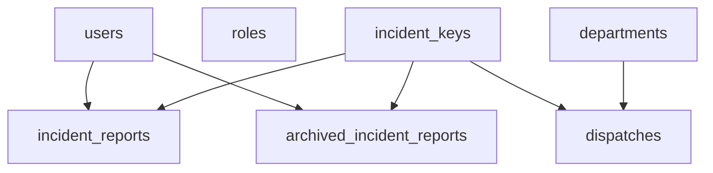

# RescueLink database catalog

Production reference for the PostgreSQL database behind the RescueLink backend. Describes the **live** Supabase project, not the bootstrap script alone.

| Item | Value |
|------|--------|
| Active project | **RescueLink DB Singapore** (`euudugvceidxbbidprxf`, ap-southeast-1) |
| Engine | PostgreSQL 17 |
| Paused / legacy | **RescueLink DB** Tokyo (`osrsaezdmjsrnzjrrzod`) — do not use for new work |
| Schema | `public` (30 base tables, 2 views) |
| Catalog updated | 2026-10-10 (post schema-audit migration `add_schema_audit_optimizations.sql`) |

## How the backend connects

- Application role: **`rescuelink_backend`** (table owner for almost all objects).
- **Row Level Security (RLS)** is **enabled** on all public tables as a backstop. There are **no RLS policies** yet. The backend role owns the tables, so it bypasses RLS the same way it did before RLS was turned on.
- **Supabase Data API** roles (`anon`, `authenticated`) have **schema `USAGE` only** — no `SELECT`/`INSERT` grants on application tables. Direct PostgREST access to app data is blocked today.
- Views: `incident_bodies`, `user_activity_summary` use **`security_invoker = true`**.

Local bootstrap: [Backend/schema.sql](../../Backend/schema.sql) plus ordered files in [Backend/migrations/](../../Backend/migrations/) (`npm run migrate`). **`schema.sql` can lag production**; this document and migrations are the operational truth for Singapore.

## Domain overview



### Identity and access

| Table | PK | Notes | Rows (approx.) |
|-------|-----|--------|----------------|
| `users` | `user_id` | `email`, `phone_number` unique; `role` + `role_id` synced by trigger | 72 |
| `roles` | `role_id` | Lookup codes: admin, dispatcher, supervisor, department-admin, department-head, responder, volunteer, user | 8 |
| `token_blacklist` | `token_hash` | JWT revocation | 24 |
| `dispatcher_login_otp` | `session_token` | Dispatcher OTP sessions | 0 |
| `responder_applications` | `id` | Volunteer onboarding workflow | 1 |

**Role sync:** `BEFORE INSERT OR UPDATE` trigger `trg_sync_user_role` on `users` runs `sync_user_role()` (search_path pinned to `public`). Prefer writing `role_id`; `role` text is kept aligned for legacy readers.

### Incidents

| Table | PK | Notes | Rows (approx.) |
|-------|-----|--------|----------------|
| `incident_keys` | `report_id` | Stable id anchor for all incident-related FKs | 99 |
| `incident_reports` | `report_id` | Active incident body; FK to `incident_keys` CASCADE | 82 |
| `archived_incident_reports` | `report_id` | Closed/historical body moved off hot table; same shape as live | 17 |
| `duplicate_clusters` | `cluster_id` | Duplicate grouping | 0 |
| `incident_coordination_notes` | `id` | Dispatcher/responder notes per report | 8 |
| `incident_escalations` | `id` | Cross-department escalations | 0 |
| `incident_responder_assignments` | `assignment_id` | Per-user assignment on a report | 0 |
| `incident_unit_usage` | `(report_id, unit_id)` | Department unit usage | 0 |
| `ai_classifications` | `classification_id` | AI output per report | 37 |
| `ai_confidence_details` | `detail_id` | Per-classification detail rows | 0 |
| `blockchain_records` | `blockchain_id` | Optional chain anchor | 1 |

**Do not merge** `incident_keys`, `incident_reports`, and `archived_incident_reports`. Counts satisfy `keys = live + archived` with zero overlap. Archive is a physical move ([incident archive live test](../../Backend/tests/incidentArchiveMove.live.test.js)). **`incident_bodies`** is a `UNION ALL` view over live + archived for reads.

### Dispatch and responders

| Table | PK | Notes | Rows (approx.) |
|-------|-----|--------|----------------|
| `responders` | `responder_id` | Partial unique on `user_id` WHERE NOT NULL | 28 |
| `responder_teams` | `team_id` | `department_code` FK → `departments.code` | 13 |
| `responder_team_members` | `id` | Team membership | 26 |
| `dispatches` | `dispatch_id` | `department_code` FK → `departments.code` | 98 |
| `responder_status_history` | `id` | Status timeline | 1 |
| `backup_requests` | `id` | Backup dispatch requests | 0 |
| `backup_responses` | `id` | Responder backup join/decline | 0 |

### Departments

| Table | PK | Notes | Rows (approx.) |
|-------|-----|--------|----------------|
| `departments` | `department_id` | `code`, `name` unique | 3 |
| `department_units` | `unit_id` | Fleet/assets | 9 |
| `department_personnel` | `personnel_id` | Staff roster | 9 |

### Notifications and audit

| Table | PK | Notes | Rows (approx.) |
|-------|-----|--------|----------------|
| `notifications` | `notification_id` | Largest table by row count | 4,044 |
| `notification_preferences` | `(user_id, event_type)` | Per-user prefs | 0 |
| `dispatcher_audit_logs` | `id` | Primary dispatcher audit trail | 573 |
| `action_logs` | `action_id` | Structured action log (empty in prod snapshot) | 0 |

**`user_activity_summary`** aggregates `action_logs`; prefer `dispatcher_audit_logs` for operational auditing until `action_logs` is populated.

## Indexes and performance (2026-10-10 audit)

Applied in `add_schema_audit_optimizations.sql`:

- **15 foreign-key covering indexes** (e.g. `dispatches.responder_id`, `dispatches.assigned_by_user_id`, archived actor columns).
- **Removed duplicate/redundant indexes:** `idx_responder_apps_*`, `idx_users_email`, `idx_departments_code`, redundant single-column report_id indexes superseded by `(report_id, created_at DESC)`.
- **`ANALYZE`** — run again after large bulk loads.
- **Function hardening:** `sync_user_role()`, `update_duplicate_clusters_updated_at()` → `SET search_path = public`.

High-traffic indexes (from `pg_stat_user_indexes` at audit time): `idx_dispatches_report_id`, `idx_incident_reports_created_at`, `idx_backup_requests_report`, coordination/escalation report+created composites.

## Integrity constraints added (audit)

- `responders_user_id_key` — unique partial index on `user_id` WHERE NOT NULL.
- `dispatches_department_code_fkey`, `responder_teams_department_code_fkey` → `departments(code)`.
- `archived_incident_reports_user_id_fkey`, `archived_incident_reports_archived_by_user_id_fkey` → `users(user_id)`.

**Not added:** `CHECK` on `incident_reports.status` — app writes multiple statuses including `closed` before archive; enumerate all writers before constraining.

## Verification

Live tests (require `DATABASE_URL` to Singapore):

```bash
cd Backend
pnpm exec jest tests/schemaConstraints.live.test.js tests/incidentArchiveMove.live.test.js tests/rolesLookup.live.test.js --runInBand --detectOpenHandles --forceExit
```

## Explicit non-goals

- Do **not** drop “empty” tables on hot FK paths (`backup_requests`, `incident_escalations`, etc.).
- Do **not** migrate integer PKs to UUID at current scale.
- Do **not** bulk-convert `timestamp without time zone` to `timestamptz` without a timezone policy.
- Aligning [Backend/schema.sql](../../Backend/schema.sql) with production is a **separate** task from this catalog.

## Related docs

- [Backend README](../../Backend/README.md) — setup and `npm run migrate`
- [API Documentation](API_DOCUMENTATION.md)
- [Security Runbook](SECURITY_RUNBOOK.md)
- [AI Integration Plan](AI_INTEGRATION_PLAN.md) — historical proposed AI tables (partially implemented)
