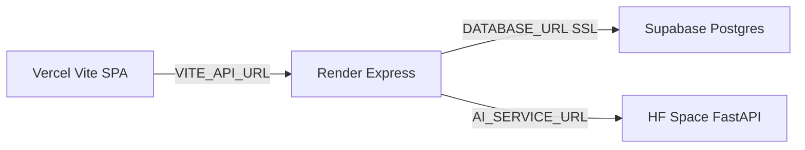

# RescueLink – Multi-platform production deployment

Production target stack:

| Layer | Platform | Repo path |
|-------|----------|-----------|
| Dispatcher dashboard (Vite SPA) | Vercel | `Frontend/Web/dispatcher_dashboard` |
| API + WebSocket | Render Web Service | `Backend` |
| PostgreSQL | Supabase | — |
| AI (FastAPI) | Hugging Face Docker Space | `RescueLink AI` |



Mobile (Flutter) and blockchain are **not** part of this four-platform map. Keep `VITE_USE_BLOCKCHAIN=false` until a blockchain host exists.

**This guide is operator documentation.** Some repo changes (Dockerfile, `vercel.json`, Render bind host, Supabase Storage for uploads) are still required before a full production cutover. Those items are listed in [Deferred repo changes](#deferred-repo-changes).

---

## Account setup order

Create accounts in this order so each dashboard has a real URL to paste into the next.

1. **Supabase** – Create a project. Copy the **direct** Postgres connection URI (`db.<project-ref>.supabase.co`, port `5432`). Never commit it.
2. **Hugging Face** – Create an empty **Docker** Space linked to this repo (or a subtree). Public URL shape: `https://<user>-<space>.hf.space`. The Space will not build successfully until the deferred `Dockerfile` and README front matter exist.
3. **Render** – New **Web Service**, root directory `Backend`, build `npm ci`, start `npm start`, health check path `/health`. First deploy may fail until `DATABASE_URL` is set; that is expected.
4. **Vercel** – Import the repo, set **Root Directory** to `Frontend/Web/dispatcher_dashboard`, framework **Vite**, build `npm run build`, output `dist`. Set `VITE_API_URL` to the Render **HTTPS** origin (no trailing slash).

**After Vercel has a URL:** set Render `FRONTEND_URL` to that exact origin (one URL only; the API does not read `CORS_ORIGIN`) and redeploy the backend.

---

## Supabase (database)

### Connection string

- Prefer the **direct** host (`db.<ref>.supabase.co:5432`) for initial schema apply and for the running API.
- The app enables TLS when `NODE_ENV=production` or `DATABASE_SSL=true` (`Backend/src/config/db.js`, `rejectUnauthorized: true`).
- Pooler URLs (`*.pooler.supabase.com`) sometimes fail certificate verification with strict SSL. If connect fails, switch to the direct URI or adjust SSL after a connectivity test.

### Schema and migrations

For a **new** empty database:

1. Apply [`Backend/schema.sql`](../../Backend/schema.sql) (Supabase SQL editor, or `psql` from a trusted machine).
2. Run **all** migrations in the order defined in [`Backend/migrations/run_migrations.js`](../../Backend/migrations/run_migrations.js) (`MIGRATION_ORDER`).

From your laptop (with `Backend/.env` pointing at Supabase):

```bash
cd Backend
# After schema.sql is applied once:
npm run migrate
```

**Do not rely on `npm run setup-db` alone for production.** Its migration list is a subset of `run_migrations.js` and omits several files (for example `add_user_location_columns.sql`, `add_incident_escalations.sql`, `add_volunteer_role.sql`, `add_user_profile_image.sql`, `add_analytics_created_at_index.sql`).

There is no Supabase CLI migration history in this repo; re-running migration SQL on a live DB may error if objects already exist. Use a fresh project for the first apply.

### Backups

- Enable Supabase backups (or schedule `pg_dump` via [`Backend/scripts/backup-db.js`](../../Backend/scripts/backup-db.js) from a secure runner with `DATABASE_URL` set).
- Test restore periodically.

---

## Render (backend API)

### Service settings

| Setting | Value |
|---------|--------|
| Root directory | `Backend` |
| Build command | `npm ci` |
| Start command | `npm start` |
| Health check path | `/health` |

Render injects `PORT`; the app reads `process.env.PORT` (`Backend/src/server.js`).

### Environment variables (secrets)

Set these in the Render dashboard. See also [`Backend/.env.example`](../../Backend/.env.example).

| Variable | Required | Notes |
|----------|----------|--------|
| `NODE_ENV` | Yes | `production` (enables DB SSL) |
| `DATABASE_URL` | Yes | Supabase Postgres URI |
| `JWT_SECRET` | Yes | 32+ random bytes; generate with `node -e "console.log(require('crypto').randomBytes(32).toString('hex'))"` |
| `FRONTEND_URL` | Yes | Vercel origin, e.g. `https://your-app.vercel.app` — **only variable used for CORS** (`Backend/src/app.js`) |
| `AI_SERVICE_URL` | Yes | HF Space origin, e.g. `https://user-space.hf.space` — not `localhost:8000` |
| `AI_INTERNAL_TOKEN` | Recommended | Same value as on the HF Space; secures backend→AI calls when configured |
| `LOG_LEVEL` | No | `info` in production |
| `SMTP_*` | If using email | Password reset / notifications |
| `IPROG_*`, `RECAPTCHA_SECRET_KEY` | If using those flows | Server-side only |

**Not used by code today:** `CORS_ORIGIN` in `.env.example` is legacy; set `FRONTEND_URL` instead.

**Firebase:** Admin SDK is loaded from a **file path** today (`FIREBASE_SERVICE_ACCOUNT_PATH`). That path is not durable on Render unless you inject the JSON another way (deferred code change). Plan phone auth accordingly.

**Uploads:** Files go to local disk (`UPLOAD_DIR`). Render’s filesystem is **ephemeral**; incident media and avatars can disappear on restart until uploads move to Supabase Storage (deferred).

**Blockchain:** Optional `BLOCKCHAIN_SERVICE_URL`; leave unset unless you host that service.

### Local parity

```bash
cd Backend
npm ci
npm start
```

---

## Vercel (dispatcher dashboard)

### Project settings

| Setting | Value |
|---------|--------|
| Root directory | `Frontend/Web/dispatcher_dashboard` |
| Framework | Vite |
| Build command | `npm run build` |
| Output directory | `dist` |

### Environment variables (build time)

`VITE_*` values are **embedded at build time**. Changing them requires a new deployment.

| Variable | Required | Notes |
|----------|----------|--------|
| `VITE_API_URL` | Yes | Render HTTPS API origin (WebSocket uses `wss://` derived from this) |
| `VITE_MAPBOX_ACCESS_TOKEN` | If maps used | Public Mapbox token |
| `VITE_ONESIGNAL_APP_ID` | If push used | Same app id as backend |
| `VITE_USE_BLOCKCHAIN` | No | Keep `false` until blockchain is hosted |

**Do not set** `VITE_DEV_MODE` in production (bypasses auth).

Set production values in the **Vercel** project settings, not in committed `.env` files.

### Known Vercel gaps (repo)

- `package.json` declares `pnpm` but the lockfile present is `package-lock.json`; align before first deploy (deferred).
- Deep links to client routes may need a SPA fallback rewrite (`vercel.json`, deferred).

---

## Hugging Face Space (AI service)

### Space type

- **SDK:** Docker (requires `Dockerfile` in `RescueLink AI` — deferred).
- **README front matter** (add when Dockerfile lands):

```yaml
---
title: RescueLink AI
sdk: docker
app_port: 7860
---
```

Local dev uses port `8000`; Spaces expect the container to listen on **7860**.

### Space secrets

See [`RescueLink AI/.env.example`](../../RescueLink%20AI/.env.example).

| Variable | Notes |
|----------|--------|
| `AI_INTERNAL_TOKEN` | Match Render |
| `ENVIRONMENT` | `production` |
| `STT_LOCAL_MODEL_SIZE` | Use `tiny` or `base` on small CPU Spaces; default `medium` plus the classifier is heavy |
| `HF_API_TOKEN` | Only if `STT_ENABLE_API_FALLBACK` / API STT is used |
| `STT_ENABLE_API_FALLBACK` | Consider `false` on Space to avoid surprise API cost |

Classifier weights (`models/emergency_model.pt`) are gitignored; the Docker image must download or mount them (deferred Dockerfile).

Backend calls: `AI_SERVICE_URL` + paths such as `/health`, `/v1/transcribe`, `/v1/classify-audio`, `/classify` (`Backend/src/services/aiService.js`).

---

## Pre-go-live checklist

### Security

- [ ] `NODE_ENV=production` on Render
- [ ] Strong `JWT_SECRET`; never use example values
- [ ] `FRONTEND_URL` set to the real Vercel origin (single origin)
- [ ] `AI_INTERNAL_TOKEN` set on Render and HF Space (same value)
- [ ] All secrets only in platform dashboards; never commit `.env`

### Database

- [ ] `schema.sql` applied, then full `npm run migrate` list
- [ ] TLS works from Render to Supabase (direct URI tested)

### Smoke tests

- [ ] `GET https://<render-host>/health` → `{ "status": "ok" }`
- [ ] Dashboard loads from Vercel; login/API calls hit Render (browser network tab)
- [ ] WebSocket connects (`wss://<render-host>/ws`) when authenticated
- [ ] `GET https://<space>/health` after Space is built

---

## Deferred repo changes

Complete after platform accounts exist and before calling production “done”:

1. **`RescueLink AI/Dockerfile`** – CPU PyTorch, port `7860`, fetch `emergency_model.pt`; README YAML front matter above.
2. **Vercel** – Resolve pnpm vs npm lockfile; add SPA rewrite in `vercel.json`.
3. **Render** – Bind `0.0.0.0` in `server.listen` for predictable health checks.
4. **Supabase tooling** – Share SSL config with `setup-db.js`, stop logging full `DATABASE_URL`, align `setup-db` migration list with `run_migrations.js`.
5. **Persistence** – Supabase Storage for uploads; Firebase service account via env JSON on Render.

---

## Common issues

| Symptom | Likely cause |
|---------|----------------|
| Browser CORS errors | `FRONTEND_URL` missing or wrong; do not use `CORS_ORIGIN` |
| API still calls `localhost:8000` | Render `AI_SERVICE_URL` unset |
| Dashboard calls wrong API | Rebuild Vercel after changing `VITE_API_URL` |
| `JWT_SECRET must be set` | Set on Render in production |
| DB connect / SSL errors | Try direct Supabase host; check `NODE_ENV=production` |
| Token works after logout | Run migration `add_token_blacklist.sql` (included in `npm run migrate`) |
| Uploaded media missing after deploy | Expected on Render until Storage migration |

---

## Self-hosted alternative (not the primary path)

For VPS deployment you may use `npm start` with PM2 and nginx as a reverse proxy to the same Node process. HTTPS termination and env vars mirror the Render table above. This repo does not ship Docker Compose for the full stack.
